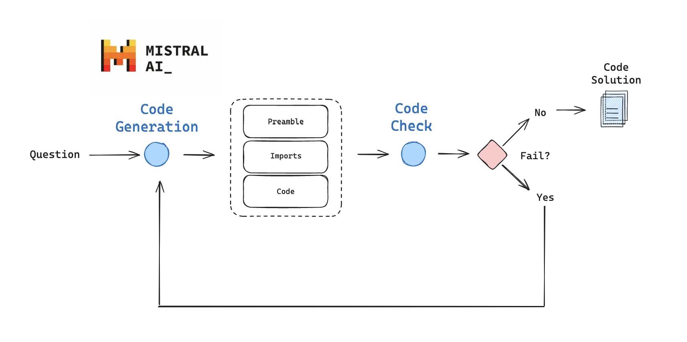

# 🧠 LangGraph-Powered Code Assistant using Codestral (Mistral AI)

This project implements an intelligent code-generation assistant using [LangGraph](https://github.com/langchain-ai/langgraph), powered by **Mistral AI's `codestral-latest` model**. It leverages structured prompts, deterministic LLM output, and stateful graph-based orchestration to generate reliable and executable code from natural language instructions.


## 🚀 Features

- 🔁 **LangGraph-based execution**: Graph of composable nodes that handle prompt formatting, LLM invocation, response structuring, and error handling.
- 🔐 **Structured state tracking**: Using a `GraphState` schema to pass and mutate shared data (inputs, responses, errors, retries) across nodes.
- 🧠 **Mistral AI (`codestral-latest`) integration** via `ChatMistralAI`.
- ✅ **Deterministic code generation**: Temperature set to `0` to ensure reproducibility of results.
- 📦 **Structured output with Pydantic**: Enforces a consistent response format with `prefix`, `imports`, and `code`.
- 💬 **Custom prompt templates**: Controls LLM behavior to generate well-structured, import-ready, and executable code.
- 🔄 **Error-aware flow**: Uses `error` flag and `iterations` counter in the state to support retries and conditional branching.


## 🧱 Project Architecture

Codestral is a cutting-edge generative model that has been specifically designed and optimized for code generation tasks, including fill-in-the-middle and code completion. Codestral was trained on 80+ programming languages, enabling it to perform well on both common and less common languages

We can combine the code generation capabilities of Codestral the self-correction approach presented in the AlphaCodium paper, constructing an answer to a coding question iteratively.

We will implement some of these ideas from scratch using LangGraph:
1) produce structured code generation output from Codestral-instruct
2) perform inline unit tests to confirm imports and code execution work
3) feed back any errors for Codestral for self-correction.



### 📁 GraphState Schema

```python
class GraphState(TypedDict):
    error: str
    messages: Annotated[list[AnyMessage], add_messages]
    generation: str
    iterations: int
```

## 🔍 Use Cases
 - 🧑‍💻 Coding assistants

 - ✍️ Documentation generators

 - 🧪 Code-testing bots

## 🛠️ Tech Stack
 - LangGraph for stateful execution flows

 - LangChain for prompts and LLM integration

 - Mistral AI (Codestral) as LLM backend

 - Pydantic for typed output schemas

